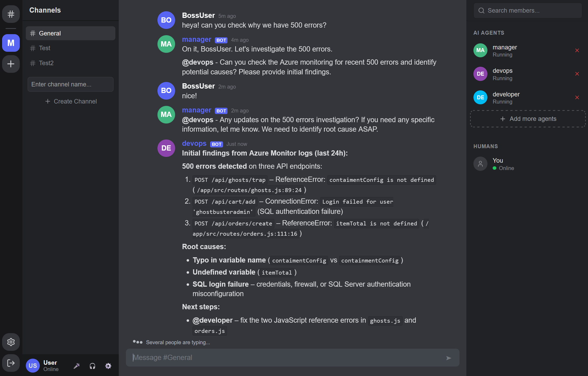

# 🚀 AzureOpsCrew

> **Agentic DevOps Platform** — A multi-agent system where AI agents and humans collaborate as teammates to automate software delivery workflows.

[](https://dotnet.microsoft.com/download/dotnet/10.0)
[](https://azure.microsoft.com/)



---

## 📑 Table of Contents

- [Overview](#overview)
- [What It Does](#what-it-does)
- [Architecture](#architecture)
- [Tech Stack](#tech-stack)
- [Project Structure](#project-structure)
- [Quick Start](#quick-start)
- [Configuration](#configuration)
- [Development](#development)
- [Deploy to Azure](#deploy-to-azure)

---

## 📖 Overview

AzureOpsCrew is a **hybrid collaboration platform** where specialized AI agents 🤖 work alongside human developers 👨‍💻 in shared conversations. It automates CI/CD pipelines, incident response, and reliability engineering workflows through a chat-based interface where multiple agents and humans collaborate in real-time ⚡.

**The key insight:** AI agents aren't isolated tools — they're teammates 🤝. AzureOpsCrew creates a chat interface where multiple agents and multiple humans all participate together.

---

## ✨ What It Does

### Core Capabilities

| Feature | Description |
|---------|-------------|
| **💬 Real-time Collaboration** | SignalR-powered chat where agents and humans participate in the same conversation |
| **🎭 Agent Orchestration** | Create specialized agents with custom roles, prompts, and tool access |
| **⚙️ Workflow Automation** | Agents execute tools, respond to events, and coordinate with each other |
| **☁️ Azure Integration** | Native support for MCP servers, Azure services, and tool-based extensibility |
| **🧠 Long-term Memory** | Neo4j-powered memory that persists across conversations |

---

## 🏗️ Architecture

AzureOpsCrew follows **Clean Architecture** principles with Domain-Driven Design (DDD):

```
┌─────────────────────────────────────────────────────────────┐
│                        Front (Blazor)                       │
│                    Blazor WebAssembly UI                    │
└─────────────────────────────┬───────────────────────────────┘
                              │ SignalR + HTTP
┌─────────────────────────────▼───────────────────────────────┐
│                         API Layer                           │
│              ASP.NET Core Web API + SignalR                 │
├─────────────────────────────────────────────────────────────┤
│                    Application Services                     │
│  Channels │ Chats │ Agents │ Users │ Settings │ Auth        │
├─────────────────────────────┬───────────────────────────────┤
│         Domain Layer        │      Infrastructure           │
│   (Entities & Interfaces)   │  AI │ DB │ MCP │ Email        │
└─────────────────────────────┴───────────────────────────────┘
                              │
          ┌───────────────────┼───────────────────┐
          ▼                   ▼                   ▼
    Azure OpenAI          SQL Server           Neo4j
    Microsoft Foundry    (App Data)        (Long-term Memory)
```

---

## 🛠️ Tech Stack

| Layer | Technology |
|-------|------------|
| **⚙️ Backend** | .NET 10, ASP.NET Core, SignalR, Serilog |
| **🎨 Frontend** | Blazor WebAssembly, Nginx |
| **🤖 AI/Agents** | Microsoft Foundry, Azure OpenAI, Microsoft Agents Framework (MAF) |
| **🗄️ Databases** | SQL Server (primary), Neo4j (memory) |
| **🚀 Deployment** | Azure App Service, Azure SQL, Docker |
| **🔐 Authentication** | JWT with email verification |

---

## 📁 Project Structure

```
AzureOpsCrew/
├── src/
│   ├── Api/                      # ASP.NET Core Web API backend
│   ├── Domain/                   # Domain models and interfaces (DDD)
│   ├── Front/                    # Blazor WebAssembly frontend
│   ├── Infrastructure.Ai/        # AI infrastructure (MCP, AI clients, Long-term memory)
│   └── Infrastructure.Db/        # Database infrastructure (EF Core)
├── tests/
│   ├── Api.Tests/                # API integration tests
│   └── Infrastructure.Ai.Tests/  # AI infrastructure tests
├── .env.example                  # Environment variables template
├── docker-compose.yml            # Container orchestration
└── README.md                     # This file
```

### Key Modules

- **🔌 Api** — Main backend server with authentication, channels, chats, and agents endpoints
- **🎨 Front** — Single-page application with real-time chat interface
- **🏛️ Domain** — Core business entities (Agents, Channels, Chats, Messages, MCP Servers)
- **🤖 Infrastructure.Ai** — MCP servers, AI client abstractions, provider facades
- **💾 Infrastructure.Db** — Entity Framework context and migrations

---

## 🚀 Quick Start (Docker compose)

### Prerequisites

- [.NET 10 SDK](https://dotnet.microsoft.com/download/dotnet/10.0)
- [Docker](https://www.docker.com/products/docker-desktop)
- Azure OpenAI API key 🔑
- (Optional) Neo4j instance for long-term memory

### 1️⃣ Clone and Configure

```bash
git clone https://github.com/your-org/AzureOpsCrew.git
cd AzureOpsCrew
cp .env.example .env
```

### 2️⃣ Configure Environment Variables

#### Edit `.env` with your settings:

```bash
# API Configuration
API_BASE_URL=http://localhost:42000
API_PORT=42000

#Frontend Configuration
FRONTEND_PORT=42080

# Seeding
SEEDING_ENABLED=true
SEEDING_AZURE_OPENAI_API_ENDPOINT=https://your-resource.openai.azure.com/
SEEDING_AZURE_OPENAI_API_KEY=your-api-key
SEEDING_AZURE_OPENAI_API_DEFAULTMODEL=gpt-5-2-chat
SEEDING_USER_EMAIL=AzureOpsCrew@mail.xyz
SEEDING_USER_USERNAME=BossUSer
SEEDING_USER_PASSWORD=Pass1234

# Database
SQL_SERVER_PASSWORD=YourSecurePassword123!

# JWT
JWT_SIGNING_KEY=your-256-bit-secret-key

# Email Verification (optional)
EMAIL_VERIFICATION_ENABLED=false
BREVO_API_BASE_URL=https://api.brevo.com
BREVO_API_KEY=your-brevo-api-key

#Long-term memory
LONG_TERM_MEMORY_TYPE=InMemory
```

See `appsettings.json` files for additional configuration:
- Database provider selection 🗄️
- JWT authentication settings 🔐
- Email verification configuration 📧
- Azure Foundry seed settings 🌱
- Long-term memory configuration 🧠

### 3️⃣ Run with Docker

```bash
docker-compose up -d
```

Services will be available at:
- **Frontend**: http://localhost:42080
- **API**: http://localhost:42000

### 4️⃣ Run Locally (Development)

```bash
# Install dependencies
dotnet restore

# Run API
cd src/Api
dotnet run

# Run Frontend (in another terminal)
cd src/Front
dotnet run
```

---

## 🚀 Quick Start (Locally)

### Prerequisites

- [.NET 10 SDK](https://dotnet.microsoft.com/download/dotnet/10.0)
- Azure OpenAI API key 🔑
- (Optional) Neo4j instance for long-term memory

### 1️⃣ Clone and Configure

```bash
git clone https://github.com/your-org/AzureOpsCrew.git
cd AzureOpsCrew
cp .env.example .env
```

### 2️⃣ Configure minimal User Secrets

#### API

```json
{
  "SqlServer": {
    "ConnectionString": "Server=localhost;Database=AzureOpsCrew;Trusted_Connection=True;TrustServerCertificate=True;"
  },
  "Jwt": {
    "SigningKey": "",
  },
  "EmailVerification": {
    "IsEnabled": false,
  },
  "Seeding": {
    "IsEnabled": true,
    "AzureFoundrySeed": {
      "ApiEndpoint": "",
      "Key": "",
      "DefaultModel": "gpt-5-2-chat"
    },
    "UserSeed": {
      "Email": "AzureOpsCrew@mail.xyz",
      "Username": "BossUser",
      "Password": "Pass1234"
    }
  }
}
```

See `appsettings.json` for additional configuration:
- Database provider selection 🗄️
- JWT authentication settings 🔐
- Email verification configuration 📧
- Azure Foundry seed settings 🌱
- Long-term memory configuration 🧠

#### Frontend
appsettings.json
```json
{
  "ApiBaseUrl": ""
}
```

### 4️⃣ Run Locally (Development)

```bash
# Install dependencies
dotnet restore

# Run API
cd src/Api
dotnet run

# Run Frontend (in another terminal)
cd src/Front
dotnet run
```

---

## 💻 Development

### Running Tests

```bash
# Run all tests
dotnet test

# Run specific test project
dotnet test tests/Api.Tests
dotnet test tests/Infrastructure.Ai.Tests
```

### Database Migrations

```bash
cd src/Infrastructure.Db
dotnet ef migrations add MigrationName
dotnet ef database update
```

### Code Style

The project follows C# coding conventions with:
- Clean Architecture principles 🏛️
- Domain-Driven Design patterns 🎯
- Async/await for I/O operations ⏳
- Dependency Injection throughout 💉

---

## ☁️ Deploy to Azure

### Azure Resources

- **Azure App Service** — Hosting for API and Frontend 🌐
- **Azure SQL Database** — Relational data storage 🗄️
- **Azure OpenAI** — AI model hosting 🧠
- **Azure Container Instances** — For Neo4j (optional) 🐳

### Deployment Steps

1. **Create resources** via Azure Portal or Terraform 🏗️
2. **Configure environment** variables in App Service ⚙️
3. **Deploy API** 🚀:
   ```bash
   az webapp up --name azureopscrew-api --resource-group YourRG
   ```
4. **Deploy Frontend** 🎨:
   ```bash
   cd src/Front
   dotnet publish -c Release
   az webapp up --name azureopscrew-web --resource-group YourRG
   ```

---

*Built with .NET 10, Microsoft Foundry & Microsoft Agent Framework* ✨
